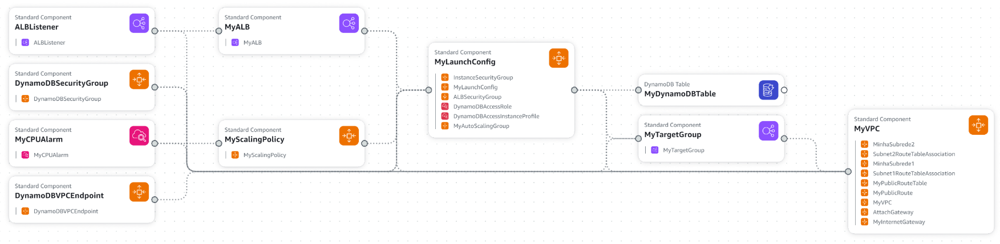
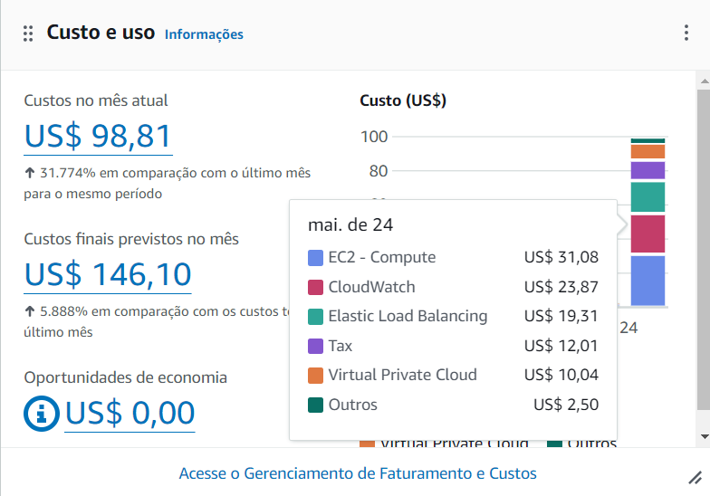
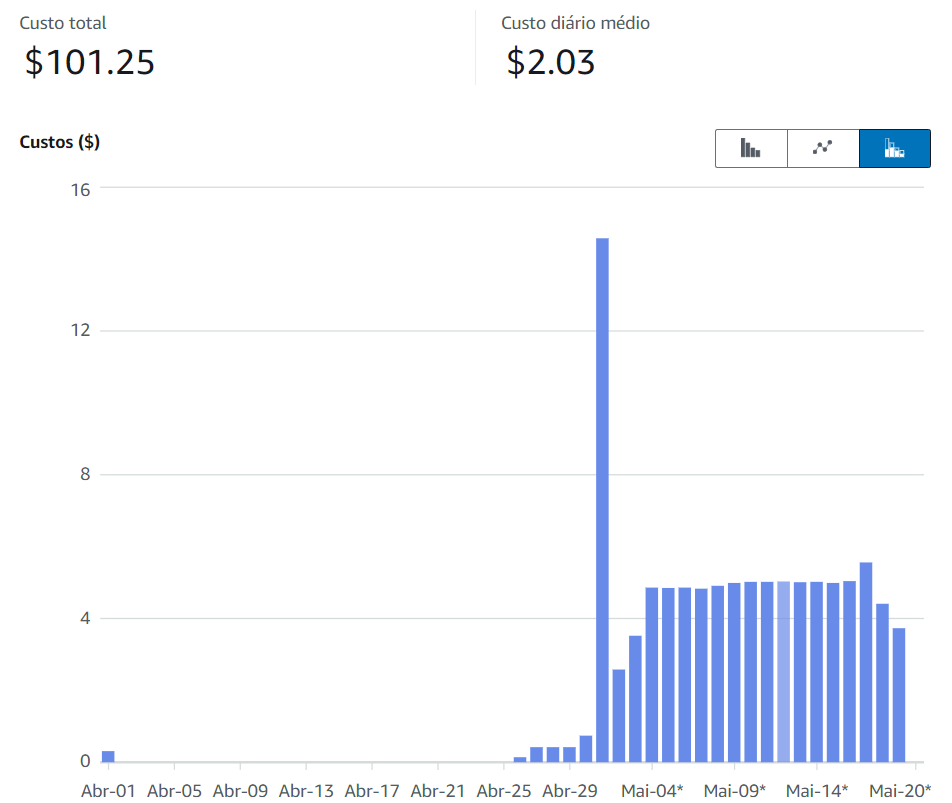
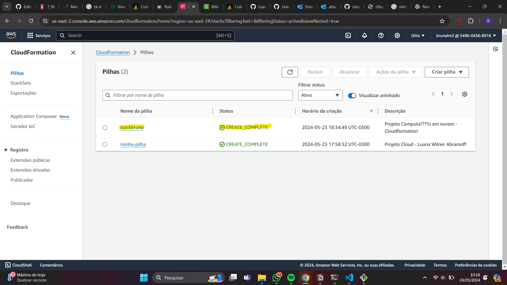
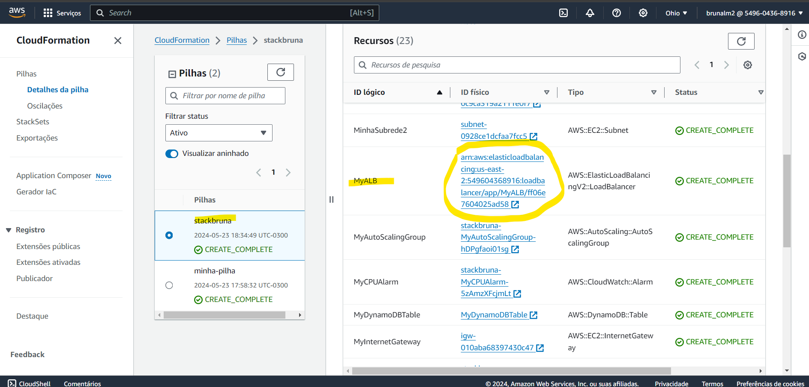
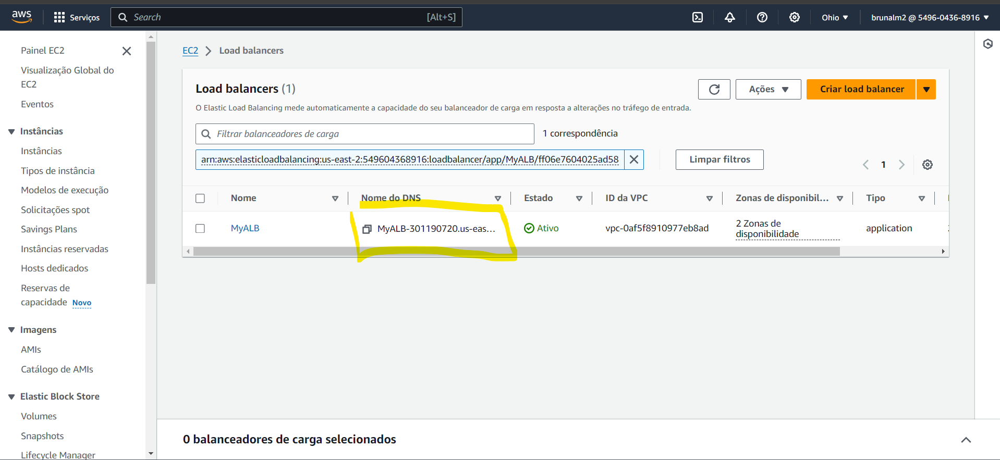
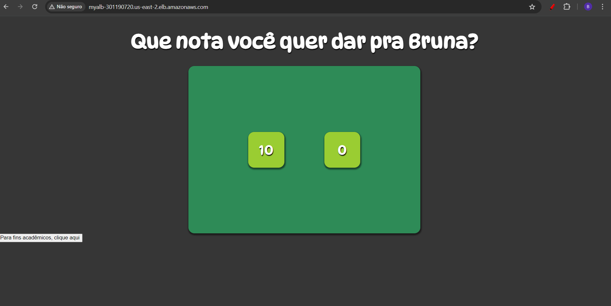
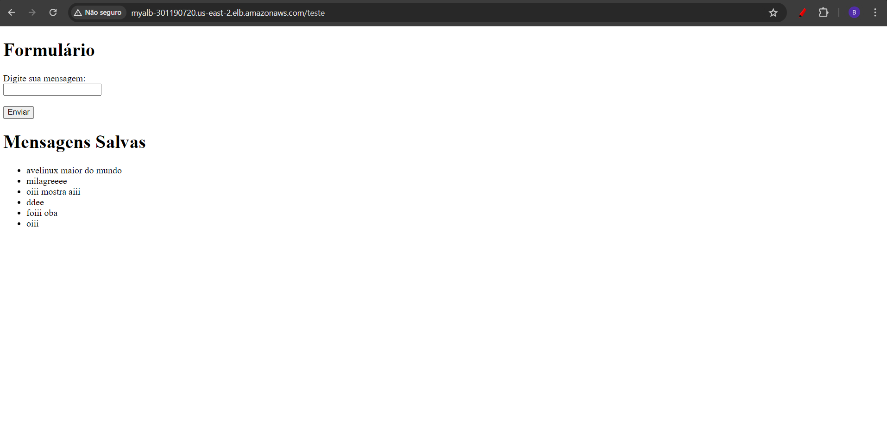

# Relatório do Projeto CloudFormation para disciplina de computação em nuvem

## Objetivo

O objetivo deste projeto é construir uma arquitetura na AWS utilizando o CloudFormation. A arquitetura envolve o uso de um Application Load Balancer (ALB), instâncias EC2 com Auto Scaling e um banco de dados DynamoDb. Para isso, será necessário construir outros recursos nesse projeto, como uma VPC, subredes, entre outras coisas para possibilitar o funcionamento da nossa nuvem privada.

### Escolha da Região de Implantação

Um dos primeiros pontos do projeto é escolher a região do AWS que suas intâncias, subredes estarão localizadas. A região escolhida para a implantação foi `us-east-2` (Ohio), devido aos custos relativamente baixos e ao bom desempenho em comparação com outras regiões da AWS. São utilizadas duas localidades dessa região, o a e o b ( `us-east-2a` e `us-east-2b`), afinal caso haja algum problema com uma dessas regiões, a outra continuará funcionando com a aplicação.

## Recursos do Projeto

### Infraestrutura como Código (IaC) com CloudFormation

Visto que o objetivo principal do projeto é a contrução de uma arquitetura via código, foi construído um arquivo yaml (main.yaml) que cria todos os recursos necessários na arquitetura. Os recursos são discutidos abaixo com as especificações.

### Preparando o terreno

Para criarmos o que o projeto pede (instâncias, load balancer e banco de dados) é necessário criar alguns recursos que irão conter essas coisas.

- **VPC:** A *Virtual Private Cloud* é nosso espacinho nos hardwares da aws que vai conter nossas instâncias virtuais.  O projeto não existe sem esse recurso. 
- **Internet Gateway:** Um gateway que conecta o VPC a internet.
- **Subredes:** É necessário criar, pelo menos, duas subredes que se conectam a VPC e estão presentes na região aws de desejo. Além disso, essas subredes estão conectadas a uma rota pública, para poder acessar a aplicação.
  
### EC2 com Auto Scaling

O Auto Scaling é utilizado para a construção das instâncias. O número de instâncias aumenta ou diminui de acordo com a utilização da aplicação. Alguns aspectos importantes do Auto Scaling são:

- **Launch Configuration:** Nesse recurso são definidas as configurações das instâncias. Nesse caso, é utilizado uma imagem de Ubuntu, a instância é de tipo `t2.micro`. Aqui também é associado aos grupos de segurança da instância de do loadbalancer (permitindo a conexão dele com as instâncias). Para subir a aplicação, é colocado nesse recurso, na parte UserData, o que queremos que "rode" na nossa instância, logo, aqui temos as bibliotecas que desejamos instalar, a clonagem do repositório e a iniciação da aplicação. Foi adicionado também as infromações em um log para debug.
- **Auto Scaling Group (ASG):** Nesse recurso, é estabelecido as zonas que as instâncias estarão presentes, as zonas estão ligadas as zonas que as subredes estão. Além disso, tem também o número mínimo, máximo e desejado de intâncias. É definido também a checagem de segurança a cada 300 segundos.
- **Políticas de Escalabilidade:** Aqui é definido quando essas instâncias novas serão criadas, isto é, quando há um "avanço" de 70% da CPU, é criado uma nova instância.
- **Grupo de Segurança:** Aqui é colocado o VPC que as instâncias estão presentes e as regras de ingresso (22, 80, 443, 5000). A 22 (SSH) foi utilizada para acessar a instância via terminal e debugar os problemas, a porta 80 (HTTP) foi utilizada para acesso da aplicação, a 443 (HTTPS) foi colocada por desencargo caso a aplicação for HTTPS e a 5000 (flask) foi colocada pois de início minha aplicação funcionava nessa porta.

### Application Load Balancer (ALB)

O Load Balancer deste projeto é *físico*, isto é, ele é um hardware presente no local que as instâncias estão.
- **O Load Balancer:** Aqui é "criado" o Load Balancer, referenciando as subredes e o grupo de segurança associado a ele.
- **Grupo de Segurança:** Aqui é construído o grupo de segurança, no qual é referenciado a VPC e também é colocado a regra de segurança de ingresso (HTTP), possibilitando o acesso para ver a aplicação.
- **Target Groups:** Este recurso gerencia as instâncias EC2. Ele executa checagens de segurança e libera o acesso a porta 80 (HTTP) para possibilitar o acesso a aplicação também.

### Banco de Dados DynamoDb

- **Tabela:** O primeiro passo foi criar uma tabela em dynamodb, configurando seu atributo identificador (id).
- **Segurança:** No grupo de segurança, foi associado ao VPC e foi liberado as instancias o acesso.
- **Role:** Este recurso é criado para colocar as permissões da tabela (como get, post etc) para possibilitar que a aplicação conecte com o banco.

## A estrutura completa construída
Aqui é possível visualizar todos os recursos criados e suas conexões.


## Análise de Custo com a Calculadora AWS

Foi utilizada a Calculadora de Custo da AWS para estimar os custos mensais da arquitetura proposta, considerando os custos de todos os recursos utilizados (EC2, ALB, DynamoDB, etc.).
Nessa imagem, podemos visualizar o custo mensal dividido pelos recursos utilizados. Aqui contém tanto o meu quanto da minha colega, por isso, dividindo por 2, temos que meu custo mensal previsto é de, aproximadamente 73 dólares. Nesse caso, fiz questão de abrir algumas vezes o link do meu load balancer pra garantir que eu estivesse "exigindo da minha aplicação"


Nessa imagem temos a "divisão" de gastos por dia, incluindo abril e maio.



# Guia de utilização
Com o AWS CLI já instalado (caso não esteja instalado, é necessário seguir o seguinte tutorial: 
https://www.treinaweb.com.br/blog/como-instalar-e-configurar-o-aws-cli)

1. Configurando o aws cli
Para checar se o aws cli foi instalado rode no terminal
``` cmd
aws version
```

Tendo certeza que o aws cli foi instalado, é possível configura-lo. Rode no terminal:
``` cmd
aws configure
```
Agora voce deve colocar suas credenciais de acesso e colocar como região `us-east-2`. O output não importa no nosso caso.

2. Criando a Key-Pair:
O formato desse comando é o seguinte:
``` cmd
aws ec2 create-key-pair --key-name <NomeDaSuaChave> --query 'KeyMaterial' --output text > <NomeDaSuaChave>.pem
```
*Lembre-se de mudar o <NomeDaSuaChave> para o nome de desejo.

3. Rodando o nosso script yaml
Com o script yaml (main.yaml) na sua máquina, rode o seguinte comando:
``` cmd
aws cloudformation create-stack --stack-name stackbruna --template-body file://main.yaml --parameters ParameterKey=KeyName,ParameterValue=<NomeDaSuaChave> --capabilities CAPABILITY_IAM
```
* Lembre-se de mudar o <NomeDaSuaChave> para o que foi definido no comando anterior
** Aqui foi colocado que a pilha se chama "stackbruna" mas caso deseje alterar, basta mudar o comando

4. Acessando a aplicação
Após rodar os comandos, acessando o dashboard de CloudFormation no AWS Console, você irá se deparar com a seguinte imagem:


Clicando na pilha e acessando a aba recursos, encontre o recurso chamado MyALB (Load Balancer)


Clique no link e voce irá acessar a parte de EC2 onde contém os Load Balancers. Copie o link do DNS e cole no seu browser.


Assim, voce terá acesso a aplicação!


No botão ali embaixo você terá acesso a um formulário só para mostrar a integração das intâncias com o banco de dados.


Fim :)

