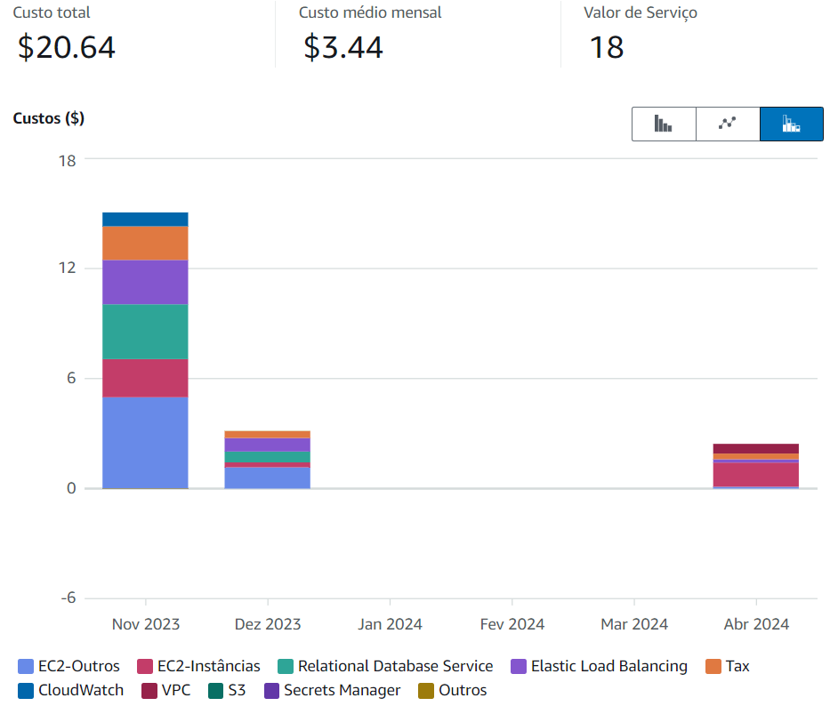

# Relatório do Projeto CloudFormation

## Objetivo

O objetivo deste projeto é provisionar uma arquitetura na AWS utilizando o CloudFormation. A arquitetura envolve o uso de um Application Load Balancer (ALB), instâncias EC2 com Auto Scaling e um banco de dados DynamoDb.

### Escolha da Região de Implantação

A região escolhida para a implantação foi `us-east-2` (Ohio), devido aos custos relativamente baixos e ao bom desempenho em comparação com outras regiões da AWS.

## Requisitos Técnicos do Projeto

### Infraestrutura como Código (IaC) com CloudFormation

- **Utilização do CloudFormation:** Todo o provisionamento de recursos na AWS foi feito utilizando o CloudFormation.
- **Estruturação do Código:** O código YAML está estruturado com comentários explicativos para cada recurso.
- **Automatização Completa:** O script CloudFormation é capaz de criar, atualizar e destruir a infraestrutura completa com um único comando, sem intervenção manual do usuário.

### EC2 com Auto Scaling

- **Launch Configuration:** Foi criada uma Launch Configuration com uma AMI que tem a aplicação pré-instalada.
- **Auto Scaling Group (ASG):** Provisionado um Auto Scaling Group utilizando a Launch Configuration criada.
- **Políticas de Escalabilidade:** Definidas políticas de escalabilidade baseadas em CloudWatch Alarms (ex: CPU Utilization > 70%).
- **Integração com ALB:** Garantida a integração do ASG com o ALB através do Target Group.

### Application Load Balancer (ALB)

- **Provisionamento:** Provisionado um ALB para distribuir o tráfego entre as instâncias EC2.
- **Target Groups:** Configurados Target Groups para gerenciar as instâncias EC2.
- **Health Checks:** Implementados Health Checks para garantir que o tráfego seja direcionado apenas para instâncias saudáveis.

### Banco de Dados DynamoDb

- **Provisionamento:** Provisionada uma instância DynamoDb.
- **Segurança:** Configurados Security Groups para garantir que apenas as instâncias EC2 possam se conectar ao banco de dados.

## A estrutura completa construída


## Análise de Custo com a Calculadora AWS

Foi utilizada a Calculadora de Custo da AWS para estimar os custos mensais da arquitetura proposta, considerando os custos de todos os recursos utilizados (EC2, ALB, DynamoDB, etc.).




## Documentação Técnica

### Diagrama da Arquitetura AWS

Diagrama da arquitetura AWS irá aqui (incluir uma imagem do diagrama).


# Guia de utilização
Com o AWS CLI já instalado (caso não esteja instalado, é necessário seguir o seguinte tutorial: 
https://www.treinaweb.com.br/blog/como-instalar-e-configurar-o-aws-cli)

1. Executar o Script CloudFormation para criar a pilha:
``` cmd
aws cloudformation create-stack --stack-name stackbruna --template-body file://main.yaml --parameters ParameterKey=KeyName,ParameterValue=mykey --capabilities CAPABILITY_IAM


